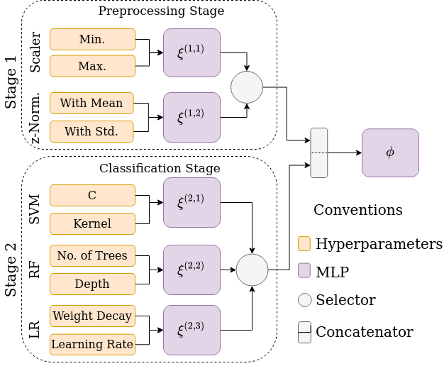

# DeepPipe: Deep Pipeline Embeddings for AutoML

*DeepPipe* efficiently optimizes Machine Learning Pipelines using meta-learning. For detailed information, refer to our [paper](https://arxiv.org/abs/2305.14009) *Deep Pipeline Embeddings for AutoML* accepted at KDD 2023.

<p align="center">
  
</p>


## Installation

We present an API for optimizing pipelines in scikit-learn based on the TensorOboe search space. You can use it to search for accurate pipelines or for benchmarking your Machine Learning model on tabular data. 

```bash
conda create -n deeppipe_env python==3.9
pip install deeppipe_api
```

## Getting started

We present an example using an OpenML dataset. However, it works with any tabular data typed as pandas dataframe.


```python
from deeppipe_api.deeppipe import load_data, openml, DeepPipe

task_id = 37
task = openml.tasks.get_task(task_id)
X_train, X_test, y_train, y_test = load_data(task, fold=0)
deep_pipe = DeepPipe(n_iters = 50,  #bo iterations
                    time_limit = 3600 #in seconds
                    )
deep_pipe.fit(X_train, y_train)
y_pred = deep_pipe.predict(X_test)

#Test
score = deep_pipe.score(X_test, y_test)
print("Test acc.:", score)

#print best pipeline
print(deep_pipe.model)
```


### Ensemble of Pipelines for optimizing Cross Validated (CV) Acc.

To optimize based on Cross Validated accuracy (less noisy optimization objective), you can use the snippet code below. Additionally, it is possible to ensemble the best pipelines, by using a greedy approach. 


```python
from deeppipe_api.deeppipe import load_data, openml, DeepPipe

task = openml.tasks.get_task(task_id=37)
X_train, X_test, y_train, y_test = load_data(task, fold=0)
deep_pipe = DeepPipe(n_iters = 50,  #bo iterations
                    time_limit = 3600, #in seconds
                    apply_cv = True,
                    create_ensemble = False,
                    ensemble_size = 10,
                    )
deep_pipe.fit(X_train, y_train)
y_pred = deep_pipe.predict(X_test)
score = deep_pipe.score(X_test, y_test)
print("Test acc.:", score) 
```

## Advanced Usage

For meta-training *DeepPipe* or testing other search spaces, you can refer to the folder `src/deeppipe_api/experiments/`.


## Our Paper

If you use this repository/package, please cite our paper:

```
@article{arango2023deep,
  title={Deep Pipeline Embeddings for AutoML},
  author={Arango, Sebastian Pineda and Grabocka, Josif},
  journal={arXiv preprint arXiv:2305.14009},
  year={2023}
}

```


